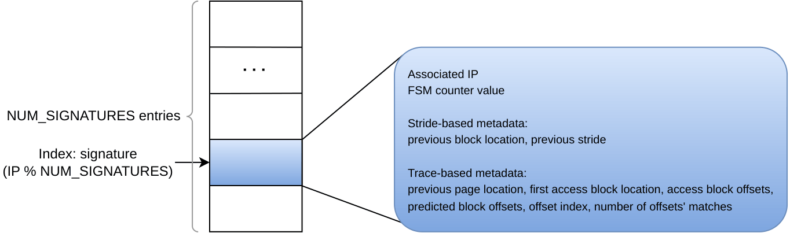
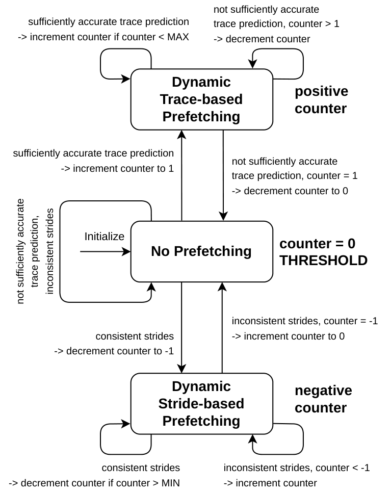
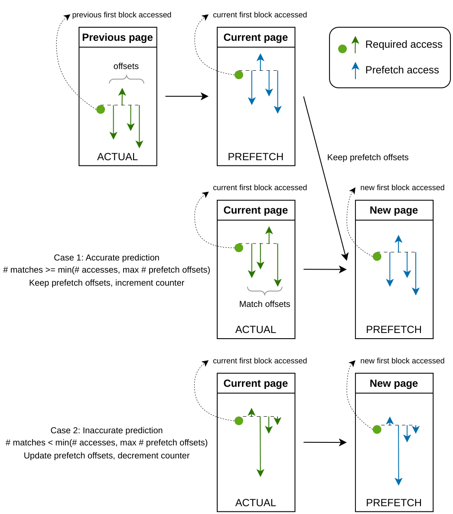
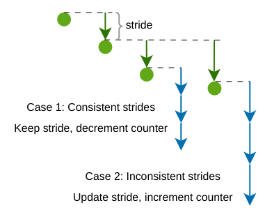
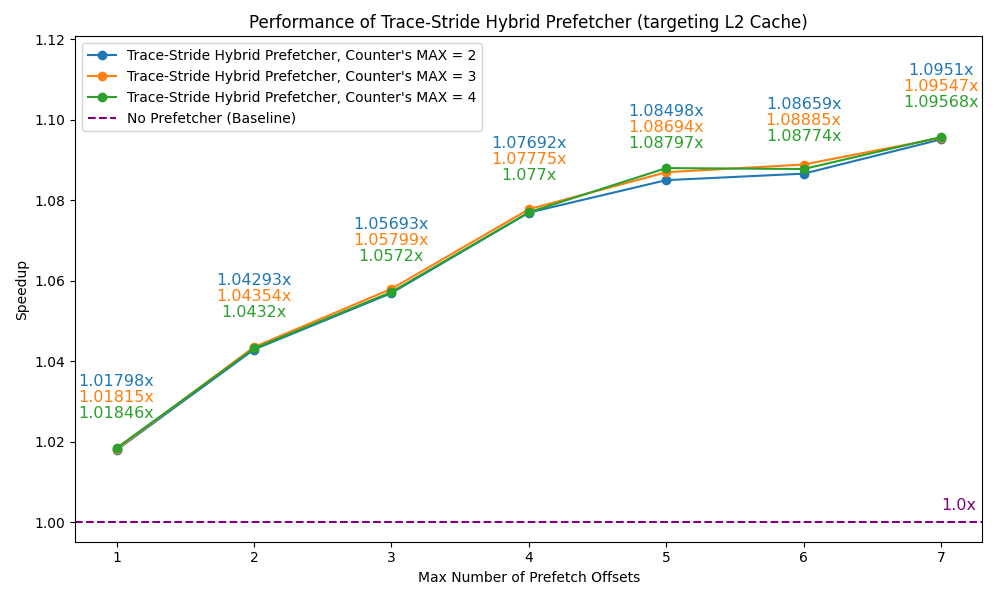
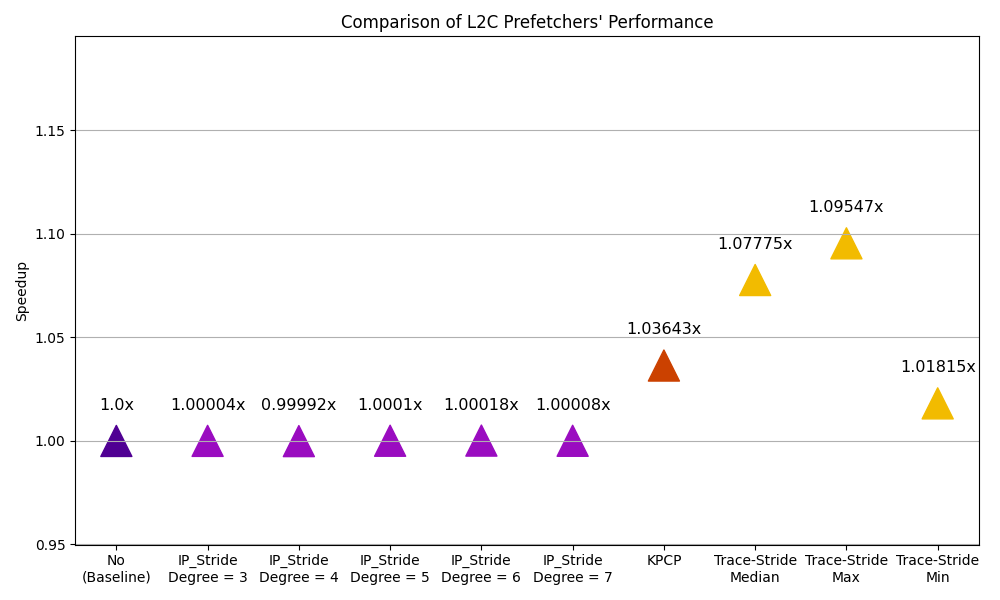

# Trace-Stride Hybrid Prefetcher for L2 Cache

## Motivation

Data-intensive applications may include regular, consistent stride access pattern, consecutively inconsistent and irregular access pattern, random or unrecognizable access patterns, or even complex mixtures from these types of access patterns.

## Overview

I designed Trace-Stride Hybrid Prefetcher that performs prefetching for L2 Cache and effectively supports programs with mixture of above patterns. It can dynamically select prefetching mode for each access instruction in the program based on pattern detection over time without causing cache pollution.

Trace-Stride Hybrid Prefetcher has 3 prefetching modes: (1) dynamic trace-based prefetching, (2) dynamic stride-based prefetching, (3) no prefetching, along with history memory buffer that stores necessary data and drives the decision of prefetching behaviors.

## Architecture Design

### History Memory Buffer

History memory buffer records necessary information for examined instructions to drive determination of prefetching mechanisms and behaviors. It is indexed based on signature of access instruction's address.

<p align="center">
    
</p>

### Per-entry FSM Counter

Each entry of history memory buffer includes FSM counter to dynamically determine appropriate prefetching mode and corresponding level of trust depending on memory access pattern that currently associated access instruction follows over time.

<p align="center">
    
</p>

### Dynamic Trace-based Prefetcher

For each entry of history memory buffer, dynamic trace-based prefetcher performs prefetching at block offsets in new accessed page based on corresponding access instruction's access block offsets in the last accessed page.

<p align="center">
    
</p>

### Dynamic Stride-based Prefetcher

For each entry of history memory buffer, dynamic stride-based prefetcher performs prefetching in strides from the last accessed location of corresponding access instruction.

<p align="center">
    
</p>

## Implementation

Trace-Stride Hybrid Prefetcher's implementation is in champsim_crc2/prefetcher/hybrid.l2c_pref file.

## Performance Benchmarking

### Configuration setup for all scenarios
* Simulation nvironment: ChampSim CRC2 simulator.
* Branch predictor: bimodal.
* Cache replacement: lru_crc2.
* Core: 1.
* Trace: mcf_10M.trace.gz (irregular-access, cache-miss-likely, low-IPC workload with baseline IPC of just about 0.0864461).
* Number of warmup instructions: 1,000,000.
* Number of simulation instructions: 10,000,000.
* Number of signatures for Trace-Stride: 64.

To test with different L2C prefetchers, use the following commands:
```
cd champsim_crc2
chmod +x run.sh
./run.sh {L2C prefetcher name}
```
{L2C prefetcher name} is one of the following: no (baseline), ip_stride, kpcp, hybrid (Trace-Stride Hybrid Prefetcher).

Benchmarking code and data results are in benchmarking/ directory.

### Trace-Stride Hybrid Prefetcher's Performance

<p align="center">
    
</p>

### Comparison of different L2C Prefetchers' Performance

<p align="center">
    
</p>
